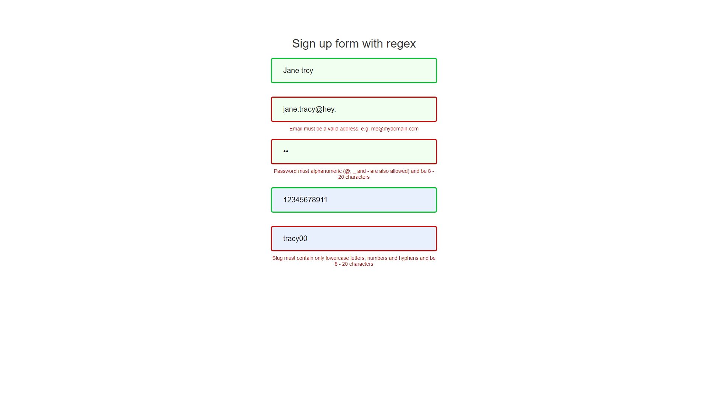

# regex-basic
# Sign up form validation with Regex
## Live Code - [Preview](https://muchirijane.github.io/regex-basic/)
<!-- ctrl+shift+v : preview -->
;

> This is a sign up form was built as i learnt regex basics.

## Description

This is a simple form that uses regex expression for validation. It uses a combination of single and quantifier meta characters to validate the values entered by a user in the input fileds. When the input value is correct the border color turns  green to show the value has matched the regex test. When the border turns red it shows the user entered the values incorrectly. Helper text appper at the bottom of the input when errors are found to guide the users.

#### Technologies

- HTML
- CSS
- SASS
- JAVASCRIPT

